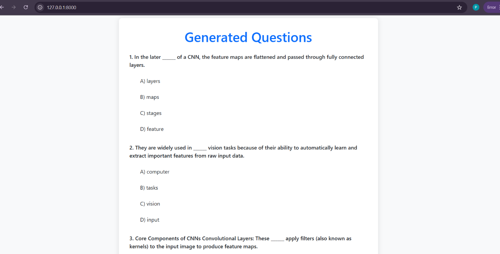
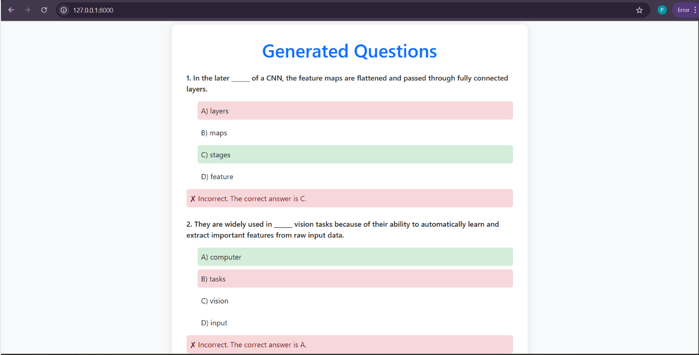

<h1 align="center" id="title">MCQ Generator Web App</h1>

<p id="description">This is a web-based application built using **FastAPI** and **SpaCy** that allows users to upload a PDF or enter custom text and generates Multiple Choice Questions (MCQs) based on the input.</p>

---

## 🚀 Features

- 📄 Upload a PDF file or input raw text
- 🔢 Choose the number of questions to generate (1–20)
- 🤖 Generates MCQs using NLP (SpaCy)
- 🎯 Automatically identifies keywords and creates distractors
- 📝 Responsive and interactive UI using Bootstrap 5
- ✅ Instant feedback on selected options (correct/incorrect)

---

## 🛠️ Tech Stack

- **Backend**: FastAPI, Python
- **NLP**: SpaCy (`en_core_web-md`)
- **PDF Reading**: PyPDF2
- **Frontend**: HTML, Bootstrap 5, Vanilla JS, Jinja2 Templates


## 📁 Folder Structure

- mcq-generator/
    - app.py     # Main FastAPI backend
    - templates/  # HTML templates
        - index.html  # Upload form
        - mcqs.html  # MCQs display page
    - static/  # Static assets (CSS, JS)
    - screenshots/  # App screenshots
        - home.png
        - mcqoutput.png
    - requirements.txt  # Python dependencies
    - README.md  # Project description


---

## 💡 How It Works

1. User uploads a **PDF file** or enters **plain text**.
2. The backend:
   - Extracts text (using `PyPDF2` if PDF)
   - Uses `SpaCy` to parse text and extract **nouns**
   - Selects sentences and replaces the most common noun with a blank
   - Generates distractors from other nouns
3. The frontend:
   - Displays MCQs with 4 options
   - Shows **interactive feedback** on selection

---

## 🧪 Example

> **Input Sentence**:  
> "The computer stores data in memory."

> **Generated MCQ**:  
> "The ______ stores data in memory."  
> A) memory  
> B) data  
> C) computer ✅  
> D) stores

---

<h2>🛠️ Installation Steps:</h2>

<p>1. Clone the repository:</p>

```
git clone https://github.com/surendrapattikonda/mcq-generator-1.git

cd mcq-generator-1
```

<p>2. Create a virtual environment and activate it:</p>

```
python -m venv venv 

venv\Scripts\activate
```

<p>3. Install dependencies:</p>

```
pip install -r requirements.txt 

python -m spacy download en_core_web_sm
```

<p>4. Run the app:</p>

```
uvicorn app:app --reload
```

<p>5. Open your browser and visit:</p>

```
http://127.0.0.1:8000/
```

## 🖼️ Screenshots

### 📥 Input Page


### 📋 MCQ Output Page



## 🔮 Future Enhancements

Use BERT or T5 or LLMs for better question quality 

Generate distractors using WordNet or external APIs

Add difficulty levels

Store user scores and answers

Export MCQs as PDF or Excel.

## 🙋‍♂️ Author
Surendra Pattikonda

B.Tech CSE (Data Science)
